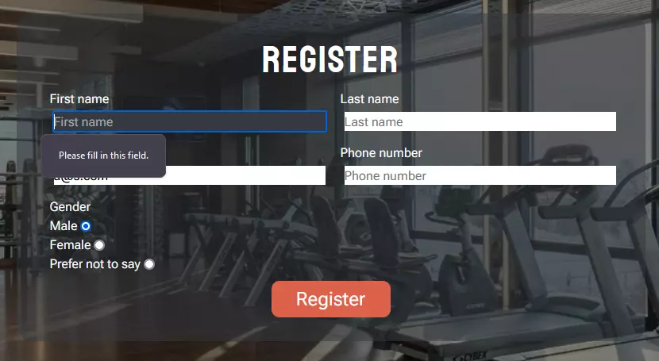

<h1 align="center"> Gym Day</h1>

## Introduction

Gym Day is a site that is designed to allow people to apply for a gym membership at a gym of the same name based in London, England. The target audience of this site is people who want to get fit at a gym and potentially wish to use a personal trainer. Gym Day aims to provide users with a quick, no hassle way to register for a membership and provides information about the gym itself - mainly through images and small amounts of text.

[The live view can be accessed here.](https://jackday94.github.io/Project1_Gym_Day/)

## Contents

## Design 

### Colours

When considering the colour scheme for the site, I wanted something that represented colours you may find within a gym such as weights, treadmills, gym attire etc. I therefore opted for a rather dark colour scheme for my hero image and header and footer, but also tried to use some colours with a brighter contrast to make things more welcoming to visitors.

### Font styles

For the font styles, I wanted something that was modern and would give strong headings that could be complemented by a lighter font for the main body. For this I used Google Fonts to choose the 'Koulen' style for headings and the logo and 'Roboto Flex' for the main body.

### Images

I chose to incorporate many images depicting people working out within a gym and some images of rooms full of gym equipment in order to showcase what the gym is like. I chose images that would work with the sections and pages that they were for. For example; the personal trainer section depicts focused shots of individuals within a gym. All of my images for this project are royalty free from Pexels or istock.

### Wireframes

I used Balsamiq Wireframes to create the basic structure of what I wanted my site to look like. This made it easier for me to focus on the styling of my site, as I already had a good idea of the layout.

- Desktop

- Mobile

  

## Features

### Existing Features

- __Navigation Bar__

  - The navigation bar is displayed on all pages of the site and features links to each page, for easy navigation and the logo of the site, which also acts as a link back to the home page.
  - The navigation bar is fixed and follows the user as they scroll the page, allowing them to click any of the navigation links wherever they are on the page.
  - When used on mobile devices, the navigation bar will act responsively by displaying vertically rather than horizontally.
  - The navigation links will change colour and underline when hovered and active, letting the user know what page they are currently on.

- __The landing page__

  - The landing page features a large background image overlayed with text welcoming people to the site and a register button to entice users to register to the Gym.
  - The background image changes on smaller devices so that the user can still determine that they are looking at a website for a gym.
    - Desktop

    

    - Mobile

    

- __Why Should you join (About us) section__

  - The about us section highlights the benefits of registering for a membership at Gym Day and shows the user why it stands apart from other gyms, encouraging them to register. 
  - A carousel of images from the gym show users what they will gain access to with their membership and highlights the fun of being part of the gym.
  - Users can interact with the carousel with the forwards and backwards arrows. This allows them to look at specific images showing different parts of the gym. 

- __Location section__

  - This section displays an embedded Google map showing the location of the gym to users, allowing them to easily find the gym. 
  - An image of the outside of the gym is displayed next to the map. This shows users what the entrance to the gym looks like so they know they have arrived at the right place.
  - The gym address is also displayed in plain text, making it easier for users to enter the address into sat navs to travel to. 

- __Peronsal trainer section__ 

  - The personal trainer section shows profiles of personal trainers who work at the gym, encouraging users to register to get the benefit of using one of these trainers. 
  - This section also helps to highlight the friendlieness of the gym and aims to make users more comfortable in their registration.

- __Footer__

  - The footer section lists the social media pages of the gym using recognised icons for easy identification. Each link opens in a new tab so it doesn't disturb the users browsing on the Gym Day page.
  - This encourages users to follow and stay connected with any updates the gym may post on social media. 

- __The Registration page__

  - The registration page allows users to register to the gym by filling out the form displayed on the page. The user is asked to provide their name, email, phone number and gender before they can submit their registration. 
  - When the user clicks submit, they are asked to confirm they wish to submit. This was done to prevent accidental submissions before the user was ready.

- __The Contact page__

  - The contact page is used to allow users to easily contact the gym about a query that they may have. On this page the user must enter their name, email, a topic and a message before they can send their message.
  - A dropdown list is provided for users to select a topic, allowing them to categorise their query more easily.
  - A confirmation box is also used when users submit, to prevent accidental submission.

- __Thank you pages__

  - When the user submits a form they are brought to either the register-complete page for the registration form, or the message-received page for the contact form. This provides feedback to the user that their submission has been completed successfully and lets them know that they will be contacted by the gym shortly after.

### Features Left to Implement

- Payment page - I feel that a payment page would be good to implement to allow users to pay for their membership at the time of registering. This would benefit users by removing the need to pay for their membership in the gym itself, and potentially allow them to renew their membership online.

## Technologies

- HTML5 - Used for the structure and content of my web pages.
- CSS3 - Used for the styling of pages.
- [Bootstrap](https://getbootstrap.com/docs/5.1/getting-started/introduction/) - Used for its mobile-first approach, giving me more time to focus on styling rather than positioning. Also used for the image [carousel](https://getbootstrap.com/docs/5.1/components/carousel/#with-indicators) and personal trainer [cards.](https://getbootstrap.com/docs/4.3/components/card/#card-decks)
- [Font Awesome](https://fontawesome.com/) - For the social media icons used in the footer and the icons in the about us section.
- [Google fonts](https://fonts.google.com/) - Used to choose the fonts for my site.
- [Gitpod](https://www.gitpod.io/) - Used as my code editor.
- [GitHub](https://github.com/) - Used for deploying and hosting my site.

## Testing 

This section details the testing I undertook to ensure that my site functioned as it was required.

### Validator Testing 

- HTML
  - No errors were returned when passing through the official [W3C validator](https://validator.w3.org/nu/?doc=https%3A%2F%2Fjackday94.github.io%2FProject1_Gym_Day%2F)
- CSS
  - No errors were found when passing through the official [(Jigsaw) validator](https://jigsaw.w3.org/css-validator/validator?uri=https%3A%2F%2Fjackday94.github.io%2FProject1_Gym_Day%2F&profile=css3svg&usermedium=all&warning=1&vextwarning=&lang=en) (The warnings produced are due to the imported bootstrap styles).
- Accessability via Lighthouse
  - No accessability issues found for the [home page.](https://googlechrome.github.io/lighthouse/viewer/?psiurl=https%3A%2F%2Fjackday94.github.io%2FProject1_Gym_Day%2F&strategy=mobile&category=performance&category=accessibility&category=best-practices&category=seo&category=pwa&utm_source=lh-chrome-ext)
  - No accessability issues found for the [register page.](https://googlechrome.github.io/lighthouse/viewer/?psiurl=https%3A%2F%2Fjackday94.github.io%2FProject1_Gym_Day%2Fregister.html&strategy=mobile&category=performance&category=accessibility&category=best-practices&category=seo&category=pwa&utm_source=lh-chrome-ext)
  - No accessability issues found for the [contact page.](https://googlechrome.github.io/lighthouse/viewer/?psiurl=https%3A%2F%2Fjackday94.github.io%2FProject1_Gym_Day%2Fcontact.html&strategy=mobile&category=performance&category=accessibility&category=best-practices&category=seo&category=pwa&utm_source=lh-chrome-ext)  

### Form Testing

I tested all my forms on the site to ensure they didn't allow the user to submit without entering the required information.

I also tested my forms to see if they would ask for confirmation before submitting.

### Unfixed Bugs

You will need to mention unfixed bugs and why they were not fixed. This section should include shortcomings of the frameworks or technologies used. Although time can be a big variable to consider, paucity of time and difficulty understanding implementation is not a valid reason to leave bugs unfixed. 

## Deployment

This section should describe the process you went through to deploy the project to a hosting platform (e.g. GitHub) 

- The site was deployed to GitHub pages. The steps to deploy are as follows: 
  - In the GitHub repository, navigate to the Settings tab 
  - From the source section drop-down menu, select the Master Branch
  - Once the master branch has been selected, the page will be automatically refreshed with a detailed ribbon display to indicate the successful deployment. 

The live link can be found here - https://code-institute-org.github.io/love-running-2.0/index.html 

## Credits 

In this section you need to reference where you got your content, media and extra help from. It is common practice to use code from other repositories and tutorials, however, it is important to be very specific about these sources to avoid plagiarism. 

You can break the credits section up into Content and Media, depending on what you have included in your project. 

### Content 

- The text for the Home page was taken from Wikipedia Article A
- Instructions on how to implement form validation on the Sign Up page was taken from [Specific YouTube Tutorial](https://www.youtube.com/)
- The icons in the footer were taken from [Font Awesome](https://fontawesome.com/)

### Media

- The photos used on the home and sign up page are from This Open Source site
- The images used for the gallery page were taken from this other open source site

Congratulations on completing your Readme, you have made another big stride in the direction of being a developer! 

## Other General Project Advice

Below you will find a couple of extra tips that may be helpful when completing your project. Remember that each of these projects will become part of your final portfolio so it’s important to allow enough time to showcase your best work! 

- One of the most basic elements of keeping a healthy commit history is with the commit message. When getting started with your project, read through [this article](https://chris.beams.io/posts/git-commit/) by Chris Beams on How to Write  a Git Commit Message 
  - Make sure to keep the messages in the imperative mood 

- When naming the files in your project directory, make sure to consider meaningful naming of files, point to specific names and sections of content.
  - For example, instead of naming an image used ‘image1.png’ consider naming it ‘landing_page_img.png’. This will ensure that there are clear file paths kept. 

- Do some extra research on good and bad coding practices, there are a handful of useful articles to read, consider reviewing the following list when getting started:
  - [Writing Your Best Code](https://learn.shayhowe.com/html-css/writing-your-best-code/)
  - [HTML & CSS Coding Best Practices](https://medium.com/@inceptiondj.info/html-css-coding-best-practice-fadb9870a00f)
  - [Google HTML/CSS Style Guide](https://google.github.io/styleguide/htmlcssguide.html#General)

Getting started with your Portfolio Projects can be daunting, planning your project can make it a lot easier to tackle, take small steps to reach the final outcome and enjoy the process! 
